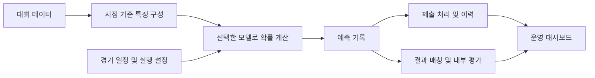

# KBO-predictor | 경기 승부예측 운영 시스템

 [](LICENSE) [](https://github.com/jinwon25/KBO-predictor/actions/workflows/checks.yml)

**KBO 경기 승부예측과 일정 연동·자동 실행·결과 분석을 연결하는 운영 시스템입니다.**

2026 스탯티즈 대학생 승부예측 대회에 참가한 4인 팀 프로젝트입니다. 데이터 처리와 모델 개발에서 웹 대시보드, 서버 및 자동 제출 운영까지 이어지는 과정을 진행하고 있습니다.

이 저장소에서는 운영 구조와 독립적으로 작성한 **합성 데이터 예제**를 확인할 수 있습니다. 실제 학습 모델·대회 데이터·자동 제출 코드는 별도로 관리합니다.

> **대회 참가·운영 중 · 2026-10-04 기준**
>
> 현재까지 구현한 기능과 설계 과정을 정리한 중간 기록입니다. 대회 종료 후 공식 결과와 공개 가능 범위를 검토해 최종 성과와 회고를 보완할 예정입니다.

## 문서 읽기 안내

[시스템 문서 안내](docs/README.md)에서 읽는 순서와 용어 풀이를 확인할 수 있습니다.

## 1. 프로젝트 개요

| 항목 | 내용 |
| --- | --- |
| 참가 대회 | 2026 스탯티즈 승부예측 대회 |
| 팀 구성 | 4인 팀 프로젝트 |
| 나의 참여 범위 | 데이터 처리, 모델 개발, 웹 UI, 서버 및 자동 제출 운영 전반 |
| 현재 상태 | 대회 참가 및 시스템 운영 중 |
| 운영본 기술 | Python · Flask · APScheduler · LightGBM · HTML/CSS/JavaScript |
| 공개 예제 기술 | Python 표준 라이브러리 · HTML/CSS/JavaScript |
| 현재 공개 범위 | 운영 구조 설명, 독립적인 합성 데이터 데모, 평가 예제, 테스트 |
| 추후 정리 | 최종 결과 검증, 공개 가능한 화면·코드·회고 검토 |

팀 작업 전체를 단독 개발 성과로 표현하지 않으며, 개인 기여율은 별도로 산정하지 않았습니다.

## 2. 해결하려는 문제

경기별 승리 확률을 계산하는 것뿐 아니라, 경기 일정에 맞춰 예측하고 제출 상태를 확인하며 결과를 추적하는 과정이 필요합니다. 모델을 변경하면서 운영하는 경우에는 적용 기간과 표본 수가 다른 성능 지표를 구분해서 해석해야 합니다.

이 프로젝트는 **예측 → 실행·제출 관리 → 결과 확인 → 모델별 분석**을 하나의 작업 흐름으로 연결하는 데 초점을 맞춥니다.

## 3. 현재 운영 시스템

2026-10-04 운영 화면과 코드 확인 기준입니다. 아래는 실제 운영 시스템의 구성으로, 공개 데모의 기능 목록과는 구분합니다.

| 영역 | 현재 구성 |
| --- | --- |
| 경기 예측 | 상단 경기 미니 카드, 홈·원정 승리 확률, 우세 팀 색상의 상세 카드 |
| 비교 지표 | 선발투수, 불펜 부담, 타선 기대득점, 구장 환경을 설명과 수치로 표시 |
| 결과 확인 | 예측 결과와 실제 결과를 연결하고 적중·실패·결과 대기 상태를 구분 |
| 통계 분석 | 모델별 적용 기간·표본 수·활성 상태, 월별·요일별 탭, 팀별 정확도·홈·원정 정렬 |
| 일정 및 실행 | 경기 일정 조회, 예측 실행 시점 설정, 자동 실행·제출 설정 |
| 관리 콘솔 | 작업실, 산출물 보관소, 모델 관리, 실행 로그, 서버 로그 |
| 공통 UI | 날짜·모델·일정에 접근하는 사이드바와 운영 상태를 표시하는 상단 바 |

### 운영 화면과 공개 데모의 차이

공개 예제 이미지는 **실제 운영 웹페이지가 아니라 별도로 작성한 합성 데이터 데모**입니다. 메뉴 구조, 카드 구성, 통계 항목, 관리 기능이 운영본과 다르므로 운영 화면을 대표하는 이미지로 사용하지 않습니다.

대회 진행 중인 현재는 실제 기록과 운영 정보가 담긴 화면을 공개 저장소에 게시하지 않습니다. 운영 화면은 직접 확인해 위 기능 설명에 반영했으며, 대회 종료 후 공개 가능 범위를 검토한 화면으로 보완할 예정입니다. 별도 예제의 화면은 [합성 데이터 데모 안내](docs/demo.md)에 구분해 두었습니다.

## 4. 운영 구조와 설계



| 운영 과제 | 설계 방향 |
| --- | --- |
| 예측 시점과 제출 상태 관리 | 일정·실행 설정·제출 이력을 함께 확인 |
| 예측과 실제 결과의 혼동 방지 | 확률, 경기 결과, 적중 여부를 별도 정보로 표시 |
| 모델 간 비교의 해석 | 적용 기간·경기 수·활성 모델을 함께 표시 |
| 많은 정보를 담는 화면의 가독성 | 미니 카드와 상세 카드 분리, 비교 지표 설명, 통계 탭과 표 정렬 |
| 운영 자료와 공개 자료의 구분 | 운영본을 보존하고 공개 예제를 별도 저장소로 관리 |

상세 범위와 평가 가정은 [아키텍처 문서](docs/architecture.md), [데이터 및 공개 정책](docs/data-policy.md)에 정리했습니다. 일정·결과에 사용하는 외부 데이터의 허용 범위 등 규정 적용 사항은 별도로 확인해야 하며, 이 문서는 운영 전체의 규정 준수를 인증하지 않습니다.

## 5. 공개 예제 실행과 검증

공개 예제는 **평가 로직과 UI 상태를 설명하는 독립적인 데모**입니다. 가상의 팀·경기·확률을 코드로 생성하며 실제 모델 학습·추론·자동 제출은 실행하지 않습니다. 운영 시스템의 전체 코드나 화면을 재현하는 저장소가 아닙니다.

Python 3.11 이상에서 추가 패키지 없이 실행할 수 있습니다.

```bash
git clone https://github.com/jinwon25/KBO-predictor.git
cd KBO-predictor
python -m demo.server
```

브라우저에서 `http://127.0.0.1:5080`을 엽니다. 서버는 로컬 주소에만 바인딩됩니다. 종료는 `Ctrl+C`입니다.

```bash
python -m unittest discover -s tests -v
python tools/check_publication.py
```

검증한 범위는 확률 정규화, 마감 전후, 미제출·제외 경기 처리, 집계 일관성, 읽기 전용 HTTP 동작입니다. 공개 데모의 테스트 통과는 운영 모델의 예측력이나 공식 대회 성적을 의미하지 않습니다. 화면과 선택적인 브라우저 검사 방법은 [데모 안내](docs/demo.md)를 참고하세요.

## 6. 진행 상황과 대회 종료 후 정리

| 구분 | 상태 |
| --- | --- |
| 예측·일정·결과 분석·관리 화면 | 구현 후 운영 중, 지속 점검 |
| 공개 문서 및 합성 데이터 예제 | 중간 공개본 작성 및 검증 |
| 공식 최종 성적·순위 | 대회 종료 후 확인 예정 |
| 실제 화면·모델·분석 자료의 추가 공개 | 대회 종료 후 규정과 팀의 공개 권한 검토 예정 |
| 최종 성과 및 회고 | 공식 결과와 운영 기록 대조 후 작성 예정 |

종료 후에는 공식 평가 기준과 기록을 대조하고, 모델 적용 기간 및 제출 누락 등을 구분해 결과를 정리할 계획입니다. 자료 공개는 대회가 끝났다는 이유만으로 자동 허용된다고 판단하지 않고 별도로 검토합니다.

## 7. 공개 범위와 저장소 구성

대회 원천 데이터, 실제 API 응답·제출 이력, 학습 가중치, 인증 정보, 운영 주소, 팀 제출 문서, 논문 원문은 포함하지 않습니다. 사후 검증에 필요한 원본 작업물은 별도로 보존합니다. 내부 정확도를 공식 대회 성적으로 제시하거나 확인되지 않은 순위·수상 실적을 기재하지 않습니다.

```text
demo/                합성 경기, 채점 예제, 로컬 읽기 전용 서버
web/                 운영본과 별개인 공개 데모 화면
tests/               평가 경계값 및 HTTP 동작 테스트
tools/               공개 파일 검사, 선택적인 브라우저 검증
docs/                운영 구조, 공개 정책, 데모 안내
.github/workflows/   Python 테스트와 공개 파일 검사
```

## 참고

- [대회 참가 페이지](https://www.statiz.co.kr/prediction/?m=university_main)
- [스탯티즈 승부예측 대회 정책안](https://statiz.co.kr/board/?b_code=10000&b_idx=4294959131&m=main&mode=view)

마지막 정리: 2026-10-04. 공개 코드의 라이선스는 [MIT](LICENSE)이며, 대회 데이터나 제3자 자료의 이용 권한을 부여하지 않습니다.

함께 볼 분석: [투수 피로 신호와 교체 의사결정](https://github.com/jinwon25/KBO-pitcher-fatigue) · [데이콘 분석·예측 대회 기록](https://github.com/jinwon25/Dacon).
