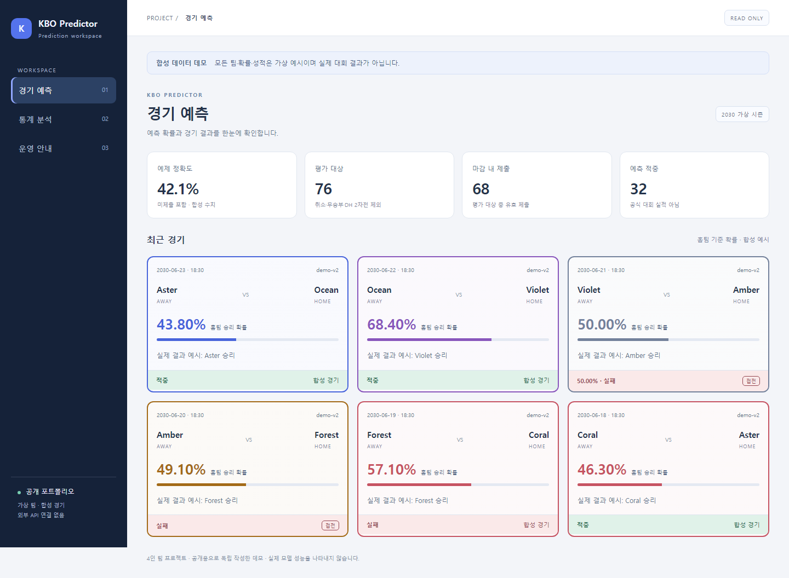
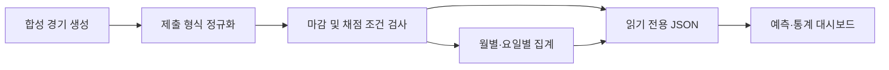
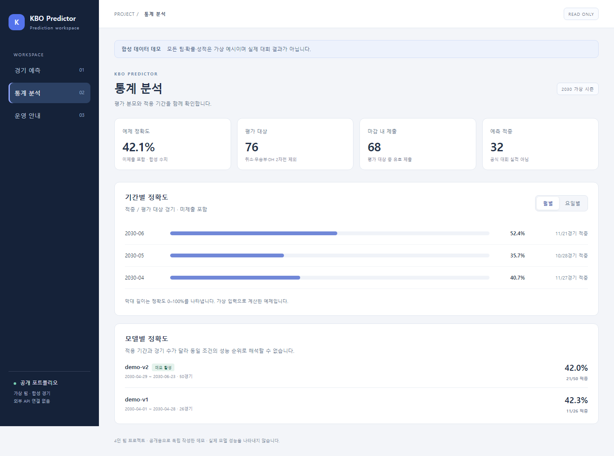

# KBO Predictor

**경기 예측을 일회성 분석에서 일정 관리·결과 추적·운영 화면으로 연결한 4인 팀 프로젝트입니다.**

스탯티즈 대학생 승부예측 대회에 참가하며 개발한 시스템의 구조와 운영 경험을 정리했습니다. 이 저장소는 공개용으로 새로 구성한 **합성 데이터 데모와 사례 연구**입니다. 운영 서버의 전체 소스나 학습된 예측 모델을 배포하는 저장소가 아닙니다.

| 항목 | 내용 |
| --- | --- |
| 프로젝트 | 2026 스탯티즈 승부예측 대회 · 4인 팀 |
| 다루는 문제 | 예측 시점 관리, 모델 변경 이력, 결과 평가, 운영 대시보드 |
| 운영 시스템 기술 | Python, Flask, APScheduler, LightGBM, HTML/CSS/JavaScript |
| 공개 데모 기술 | Python 3.11+, 표준 라이브러리, HTML/CSS/JavaScript |
| 데이터 | 코드에서 생성한 가상 팀·경기·확률만 사용 |
| 공개 범위 | 설계 문서, 독립적인 평가 예제, 읽기 전용 데모, 테스트 |



## 1. 해결하려는 문제

모델이 승리 확률을 계산해도, 제출 시각을 놓치거나 결과를 잘못 연결하면 운영 결과는 달라집니다. 여러 모델의 정확도를 비교할 때도 적용 기간과 경기 수가 다르면 수치만으로 우열을 판단하기 어렵습니다.

운영 시스템은 경기 예측, 스케줄 설정, 결과 집계, 모델 관리 화면을 연결합니다. 공개 데모에서는 실제 데이터와 제출 기능을 분리하고, 이 중 **확률 표시·채점 조건·평가 분모·화면 상태**를 재현합니다.

## 2. 주요 설계

| 문제 | 설계 방향 | 공개본에서 확인할 수 있는 것 |
| --- | --- | --- |
| 예측 확률과 적중 여부 혼동 | 예측과 실제 결과를 별도 필드로 관리 | 팀 색 테두리, 적중·실패 음영과 텍스트 |
| 내부 정확도와 대회 점수 혼동 | 제출 누락을 포함한 평가 분모를 명시 | 평가 대상·제출·적중 수와 실패 사유 |
| 50% 및 제출 마감 경계 | 소수 둘째 자리와 시각 경계를 명시적으로 처리 | 순수 함수와 경계값 테스트 |
| 적용 기간이 다른 모델 비교 | 기간·표본 수·활성 상태를 함께 표시 | 통계 화면의 모델 요약 |
| 정보가 많은 운영 화면 | 예측·통계·운영 안내를 구분 | 반응형 메뉴와 월별·요일별 탭 |
| 대회 데이터 유출 위험 | 공개용 저장소를 운영본과 분리 | 외부 API·인증키·학습 가중치 없는 데모 |



실제 운영 구조와 공개 데모의 차이는 [아키텍처 문서](docs/architecture.md)에 정리했습니다. 데모에는 모델 학습·실제 추론·외부 제출·스케줄 실행 기능이 없습니다.

## 3. 실행 방법

Python 3.11 이상에서 추가 패키지 설치 없이 실행할 수 있습니다.

```bash
git clone https://github.com/jinwon25/kbo-predictor.git
cd kbo-predictor
python -m demo.server
```

브라우저에서 `http://127.0.0.1:5080`을 엽니다. 서버는 기본적으로 로컬 주소에만 바인딩됩니다. 종료는 `Ctrl+C`입니다.

```bash
python -m unittest discover -s tests -v
python tools/check_publication.py
```

화면 검증은 선택 사항입니다. Playwright를 설치하면 5개 화면 폭에서 세 화면과 통계 탭을 검사하고 합성 화면 이미지를 생성합니다.

```bash
python -m pip install playwright
python -m playwright install chromium
python tools/check_ui.py
```

화면의 날짜·확률·정확도는 모두 재현 가능한 합성 예시입니다. **대회 실적이나 모델 성능의 근거로 사용할 수 없습니다.**

## 4. 평가 기준



- 승률은 홈팀 기준 백분율이며 소수점 둘째 자리로 정규화합니다.
- 정규화 후 `50.00%`, 미제출, 마감 후 제출은 실패로 처리합니다.
- 취소·무승부·더블헤더 2차전은 평가에서 제외합니다.
- 대회 방식 예제의 분모는 제출 경기 수가 아니라 평가 대상 경기 수입니다.
- 월별·요일별 수치는 동일한 채점 함수에서 계산합니다.

공개본은 제공된 안내문과 공식 정책을 참고한 **교육용 구현**입니다. 주최 측 채점 서버와 동등함을 인증한 구현이 아닙니다. 둘째 자리 경계의 반올림 방식과 마감 정각 수신 처리는 [규정 검토 문서](docs/data-policy.md)의 가정을 참고하세요.

## 5. 팀 프로젝트와 기여 표기

4인 팀 프로젝트에서 데이터 처리, 모델 개발, 웹 UI, 서버 및 자동 제출 운영 전반에 참여했습니다. 특정 영역의 단독 개발이나 개인 기여율을 주장하지 않습니다. 공개 데모 코드는 포트폴리오 설명을 위해 새로 작성했으며, 팀원 모델 파일과 공동 분석 원문은 포함하지 않았습니다.

## 6. 공개 범위와 제한

실제 대회 데이터, API 응답, 제출 이력, 학습 가중치, 인증 정보, 운영 주소, 팀 제출 문서, 논문 PDF는 포함하지 않습니다. 원본 작업물은 사후 검증을 위해 별도로 보존합니다.

공식 순위나 수상 실적은 이 저장소에서 주장하지 않습니다. 운영 대시보드의 내부 정확도도 공식 대회 정확도로 제시하지 않습니다. 상세 기준은 [데이터 및 공개 정책](docs/data-policy.md)을 참고하세요.

## 7. 저장소 구성

```text
demo/                합성 경기, 채점 함수, 로컬 읽기 전용 서버
web/                 반응형 공개 데모 화면
tests/               규정 경계값 및 HTTP 동작 테스트
tools/               공개 파일 검사, 선택적인 브라우저 검증
docs/                아키텍처, 공개 정책, 합성 화면 이미지
.github/workflows/   Python 테스트와 공개 파일 검사
```

## 참고

- [대회 참가 페이지](https://www.statiz.co.kr/prediction/?m=university_main)
- [스탯티즈 승부예측 대회 정책안](https://statiz.co.kr/board/?b_code=10000&b_idx=4294959131&m=main&mode=view)

공식 정책과 참가자 안내를 확인한 날짜: 2026-10-04. 공개 코드의 라이선스는 [MIT](LICENSE)입니다. 대회 데이터나 제3자 자료의 이용 권한을 부여하는 라이선스가 아닙니다.
