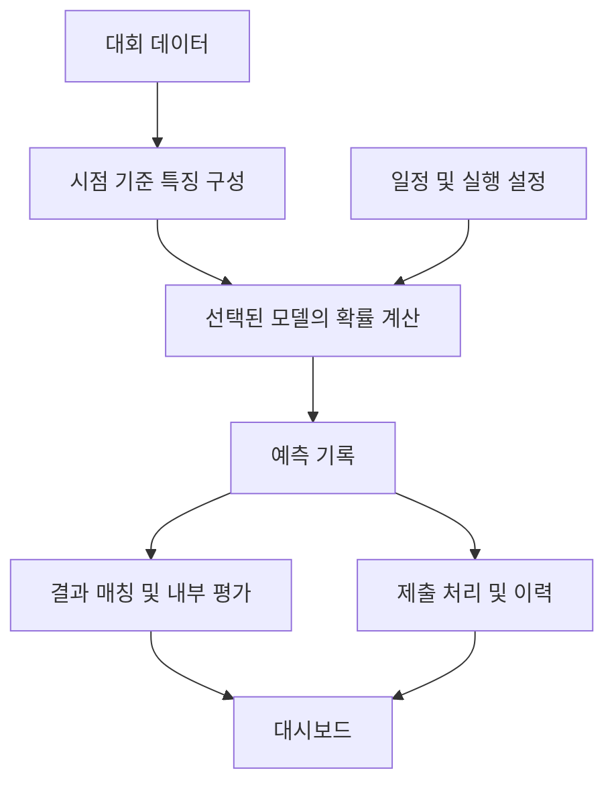

# 시스템 구조와 공개 데모

## 운영 시스템에서 다룬 범위

운영 프로젝트에는 Flask 웹 서버, 일정 기반 예측 실행, 모델 선택, 제출 기록, 결과 집계, 분석 화면이 있습니다. 모델 코드와 학습 산출물은 별도로 관리합니다. 열람한 운영 설정에서는 `predictor_v13`의 `pit_lgbm_v1` 모드가 선택되어 있었습니다. 파일 이름만으로 실제 서비스 중인 알고리즘을 설명하지 않도록 구분했습니다.

이 그림은 책임 구분을 설명합니다. 운영 시스템의 모든 경로가 대회 규정에 적합하다는 검증 결과를 의미하지 않습니다. 외부 데이터 이용 범위, 마감 전 전송 완료, 참가자 페이지의 실제 기록 대조는 별도 운영 점검이 필요합니다.

## 공개본에서 재구성한 범위

`demo/fixtures.py`는 가상 팀과 경기의 입력을 결정적으로 생성합니다. 외부 데이터에서 일부 값을 바꾸거나 실제 기록을 익명화한 자료가 아닙니다. `demo/scoring.py`는 확률 정규화, 제출 시점, 제외 조건을 검사합니다. `demo/server.py`는 정해진 정적 파일과 합성 API만 제공합니다.

공개 화면은 운영 UI에서 다룬 문제를 작은 독립 예제로 재구성했습니다. 전체 운영 화면의 복제본이 아니며, 데모의 가상 모델명과 경기 수는 실제 이력이 아닙니다. 관리 화면은 실행 기능 대신 공개 범위를 설명합니다. 외부 호출·파일 업로드·모델 교체·실제 제출은 구현하지 않았습니다.

## 평가와 재현성

채점 대상 여부를 먼저 판정한 뒤 제출 상태와 적중 여부를 구분합니다. 유효 확률을 제출했더라도 `50.00%`이면 제출 건수에는 포함되지만 적중하지 않습니다. 미제출은 분모에 포함됩니다. 무승부 등 제외 경기는 분모에도 포함하지 않습니다.

모든 집계는 같은 함수의 출력으로 생성합니다. 월별과 요일별 화면에서 서로 다른 분모를 사용하는 문제를 방지합니다. 시간은 오프셋이 있는 ISO 8601 값으로 다룹니다. 데모의 반올림은 `ROUND_HALF_UP`, 마감 시각과 같은 수신 시각은 허용하는 것으로 구현했습니다. 이는 공개 안내에서 명확하지 않은 경계에 대한 예제 가정입니다. 실제 제출은 충분한 시간 여유를 두고 완료해야 합니다.

## 검증 방법

표준 라이브러리 테스트로 확률 범위, 유효하지 않은 입력, 소수 둘째 자리, 미제출, 마감 전후, 제외 경기, 집계 분모를 확인합니다. HTTP 테스트는 허용된 파일, 없는 경로, 쓰기 요청 차단을 확인합니다. 선택적인 Playwright 검증은 데스크톱과 모바일에서 모든 탭을 열어 가로 넘침과 브라우저 오류를 검사합니다.

모델의 예측력·공식 순위·운영 서버의 실시간 상태는 이 테스트의 검증 대상이 아닙니다.
